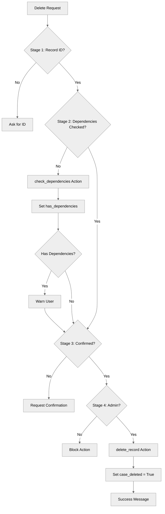

# SafetyAndGuardrails

## Overview

Learn essential **safety patterns** for production agents. This recipe demonstrates multi-stage validation, explicit confirmations, dependency checking, and permissions for record deletion operations.

## Agent Flow



## Key Concepts

- **Multi-stage validation**: Check prerequisites at multiple points
- **Explicit confirmation**: Require user approval for destructive actions
- **Dependency checking**: Verify no dependent records exist
- **Role-based safety**: Restrict actions by user permissions
- **Conditional availability**: Use `available when` for safety gates
- **Clear warnings**: Inform users of consequences

## How It Works

### Multi-Stage Validation in Instructions

```agentscript
instructions:->
   # Safety pattern: Multi-stage validation
   if not @variables.record_id:
      | Ask for record ID to delete.

   # Check dependencies first
   if @variables.record_id and not @variables.has_dependencies:
      run @actions.check_dependencies
         with record_id=@variables.record_id
         # ...

   # Warn about dependencies
   if @variables.has_dependencies and @variables.dependency_count > 0:
      | ⚠️ WARNING: This record has {!@variables.dependency_count} dependent records.
```

### Explicit Confirmation Pattern

```agentscript
instructions:->
   # Require explicit confirmation
   if not @variables.confirmation_received:
      | ⚠️ IMPORTANT: Deletion is permanent and cannot be undone.
      | Record: {!@variables.record_id}
      | To proceed, please type "CONFIRM DELETE"
```

### Role-Based Safety

```agentscript
actions:
   # Safety: Require confirmation AND admin role
   delete_record: @actions.delete_record
      available when @variables.confirmation_received and @variables.is_admin
      with record_id=@variables.record_id
      with confirmed=True
```

## Key Code Snippets

### Complete Variables

```agentscript
variables:
   record_id: mutable string = ""
      description: "Record ID to delete"

   record_type: mutable string = ""
      description: "Type of record"

   confirmation_received: mutable boolean = False
      description: "Whether user confirmed deletion"

   is_admin: mutable boolean = True
      description: "Whether user has admin privileges"

   has_dependencies: mutable boolean = False
      description: "Whether record has dependencies"

   dependency_count: mutable number = 0
      description: "Number of dependent records"
```

### Complete Action Definitions

```agentscript
actions:
   check_dependencies:
      description: "Checks if record has dependencies"
      inputs:
         record_id: string
      outputs:
         has_dependencies: boolean
         count: number
         record_type: string
      target: "flow://CheckDependencies"

   delete_record:
      description: "Deletes a record permanently"
      inputs:
         record_id: string
         confirmed: boolean
      outputs:
         success: boolean
      target: "flow://DeleteRecord"
```

## Try It Out

### Example: Safe Deletion Flow

```text
User: Delete record REC-123

Agent: [Runs check_dependencies]
       ⚠️ WARNING: This record has 3 dependent records.
       Deleting it will affect:
       - 3 related records
       - Data integrity

       Are you absolutely sure? Type "CONFIRM DELETE" to proceed.

User: CONFIRM DELETE

Agent: Proceeding with deletion after confirmation.
       [Calls delete_record]
```

## Safety Patterns

### Pattern 1: Sequential Gates

```agentscript
# Gate 1: Must have record ID
if not @variables.record_id

# Gate 2: Must check dependencies
if @variables.record_id and not @variables.has_dependencies

# Gate 3: Must confirm
if not @variables.confirmation_received
```

### Pattern 2: Combined Conditions

```agentscript
delete_record: @actions.delete_record
   available when @variables.confirmation_received and @variables.is_admin
```

## Best Practices

✅ **Check dependencies first** - Verify no dependent records

✅ **Require explicit confirmation** - For destructive actions

✅ **Role-based restrictions** - Limit who can perform dangerous actions

✅ **Clear warnings** - Inform users of consequences

✅ **Cannot be undone message** - Make permanence clear

❌ **Don't skip confirmation** - Always require for deletions

❌ **Don't auto-delete** - Always require user action

## What's Next

- **ErrorHandling**: More validation patterns
- **DynamicActionRouting**: Combine with conditional availability
- **CustomerServiceAgent**: See safety in a complete agent

## Testing

### Test Case 1: Missing Record

- Try to delete without ID
- Verify: Agent asks for ID

### Test Case 2: Dependency Warning

- Provide ID
- Verify: Agent checks dependencies and warns

### Test Case 3: Confirmation

- Verify: Agent asks for "CONFIRM DELETE"
- Verify: Action not available until confirmed

### Test Case 4: Admin Check

- Verify: Action requires is_admin=True
