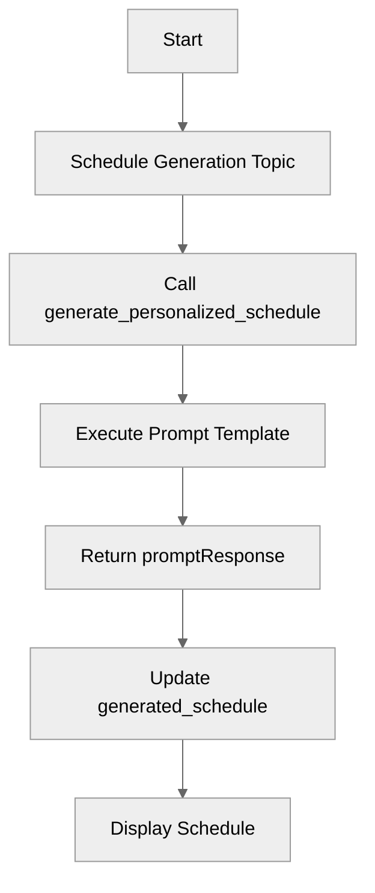

# PromptTemplateActions

## Overview

Learn how to **invoke Salesforce Prompt Templates** as actions within your agent. This allows you to leverage the full power of Prompt Builder, including grounded data and flexible templates.

## Agent Flow



## Key Concepts

- **Target Protocol**: Use `prompt://<DeveloperName>` to target a prompt template.
- **Inputs/Outputs**: Inputs match the prompt template's inputs. The output is typically a single string response.

## How It Works

### 1. Define the Action

Define an action that points to your Prompt Template's API name (Developer Name).

### 2. Use the Action

Call the action in your instructions or let the reasoning engine select it.

## Key Code Snippets

### Action Definition

```agentscript
actions:
   generate_personalized_schedule:
      description: "Generates a schedule based on guest interests"
      inputs:
         email: string
      outputs:
         promptResponse: string
      target: "prompt://Generate_Personalized_Schedule"
```

### Action Usage

```agentscript
run @actions.generate_personalized_schedule
   with email=@variables.guest_email
   set @variables.generated_schedule = @outputs.promptResponse
```

## Try It Out

### Example Interaction

```text
Agent: Hi! I can generate personalized schedules using Prompt Templates.

User: Generate a personalized schedule of experiences for me.

Agent: To create a personalized schedule for you, please provide your email address.

User: alex.reed@xample.com

Agent: Here is your personalized schedule of experiences ...

```
