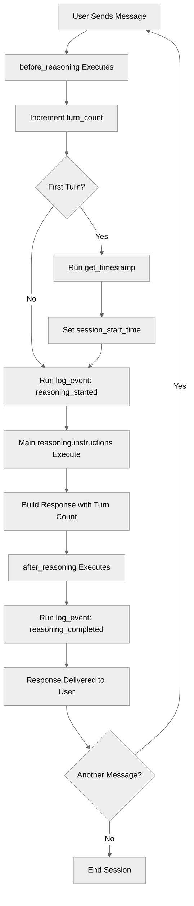

# BeforeAfterReasoning

## Overview

Learn how to use **reasoning lifecycle events** with `before_reasoning` and `after_reasoning`. These hooks let you execute code before and after every reasoning step, enabling initialization, logging, cleanup, and state management patterns.

## Agent Flow



## Key Concepts

- **`before_reasoning`**: Executes before every reasoning step
- **`after_reasoning`**: Executes after every reasoning step
- **Lifecycle hooks**: Automatic execution on every turn
- **Initialization patterns**: Setup state on first turn
- **Logging patterns**: Track every interaction
- **State updates**: Modify variables at lifecycle points

## How It Works

### before_reasoning Block

Runs **before** the agent processes each user message:

```agentscript
topic conversation:
   before_reasoning:
      # Increment turn counter
      set @variables.turn_count = @variables.turn_count + 1

      # Initialize on first turn
      if @variables.turn_count == 1:
         run @actions.get_timestamp
            set @variables.session_start_time = @outputs.current_timestamp

      # Log the reasoning start
      run @actions.log_event
         with event_type="reasoning_started"
         with event_data="Turn: {!@variables.turn_count}"
```

**Use for:**

- Incrementing counters
- Initializing session state
- Loading required data
- Logging start of operations

### after_reasoning Block

Runs **after** the agent completes reasoning:

```agentscript
topic conversation:
   after_reasoning:
      # Log the reasoning completion
      run @actions.log_event
         with event_type="reasoning_completed"
         with event_data="Turn {!@variables.turn_count} completed"
```

**Use for:**

- Logging completion
- Cleanup operations
- Analytics tracking

### Complete Topic Structure

```agentscript
topic conversation:
   description: "Provides a conversation with lifecycle event tracking"

   actions:
      get_timestamp:
         description: "Get current timestamp"
         outputs:
            current_timestamp: string
               description: "Current timestamp in ISO 8601 format"
         target: "flow://GetCurrentTimestamp"

      log_event:
         description: "Log an event to the system"
         inputs:
            event_type: string
               description: "Type of event being logged"
            event_data: string
               description: "Additional data or context about the event"
         outputs:
            logged: boolean
               description: "Indicates whether the event was successfully logged"
         target: "flow://LogEvent"

   before_reasoning:
      set @variables.turn_count = @variables.turn_count + 1
      if @variables.turn_count == 1:
         run @actions.get_timestamp
            set @variables.session_start_time = @outputs.current_timestamp
      run @actions.log_event
         with event_type="reasoning_started"
         with event_data="Turn: {!@variables.turn_count}"

   reasoning:
      instructions:->
         | Every time you interact with the user, respond to their message and append the session info with turn count to your response.
         |
         | Session Start: {!@variables.session_start_time}
         | Current Turn Count: {!@variables.turn_count}

   after_reasoning:
      run @actions.log_event
         with event_type="reasoning_completed"
         with event_data="Turn {!@variables.turn_count} completed"
```

## Key Code Snippets

### Turn Counter Pattern

```agentscript
variables:
   turn_count: mutable number = 0
      description: "Number of conversation turns"

topic conversation:
   before_reasoning:
      set @variables.turn_count = @variables.turn_count + 1
```

### Session Initialization Pattern

```agentscript
before_reasoning:
   if @variables.turn_count == 1:
      run @actions.get_timestamp
         set @variables.session_start_time = @outputs.current_timestamp
```

### Logging Pattern

```agentscript
before_reasoning:
   run @actions.log_event
      with event_type="reasoning_started"
      with event_data="Turn: {!@variables.turn_count}"

after_reasoning:
   run @actions.log_event
      with event_type="reasoning_completed"
      with event_data="Turn {!@variables.turn_count} completed"
```

## Try It Out

### Example: Turn Counter and Logging

```text
[Turn 1]
User: Hello

[before_reasoning executes:]
  - turn_count = 1
  - get_timestamp → session_start_time set
  - log_event("reasoning_started", "Turn: 1")

[reasoning executes:]
  - Instructions built with turn count

Agent: Hello! Welcome to the conversation. Current Turn Count: 1

[after_reasoning executes:]
  - log_event("reasoning_completed", "Turn 1 completed")

---

[Turn 2]
User: How are you?

[before_reasoning executes:]
  - turn_count = 2
  - log_event("reasoning_started", "Turn: 2")

[reasoning executes:]
  - Instructions built with turn count

Agent: I'm great! Current Turn Count: 2

[after_reasoning executes:]
  - log_event("reasoning_completed", "Turn 2 completed")
```

## Common Use Cases

### Session Initialization

```agentscript
before_reasoning:
   if @variables.turn_count == 1:
      run @actions.init_session
         with session_id=@variables.session_id
```

### Pre-loading Data

```agentscript
before_reasoning:
   if @variables.user_id and not @variables.user_profile:
      run @actions.fetch_user_profile
         with user_id=@variables.user_id
         set @variables.user_profile = @outputs.profile
```

### Activity Tracking

```agentscript
after_reasoning:
   run @actions.update_last_activity
      with session_id=@variables.session_id
```

### Comprehensive Logging

```agentscript
before_reasoning:
   run @actions.log_event
      with event_type="turn_started"
      with event_data="Turn {!@variables.turn_count}"

after_reasoning:
   run @actions.log_event
      with event_type="turn_completed"
      with event_data="Turn {!@variables.turn_count}"
```

## Best Practices

✅ **Keep before_reasoning fast** - Avoid slow operations that delay responses

✅ **Use after_reasoning for logging** - Don't block the response

✅ **Initialize once** - Check flags to avoid re-initialization

✅ **Handle errors gracefully** - Don't let lifecycle events break reasoning

❌ **Don't overload lifecycle events** - Keep them focused and efficient

❌ **Don't use for main logic** - Use reasoning instructions instead

## Lifecycle vs Instructions

| Aspect               | before_reasoning | instructions:->    | after_reasoning |
| -------------------- | ---------------- | ------------------ | --------------- |
| **When**             | Before reasoning | During reasoning   | After reasoning |
| **Purpose**          | Setup, init      | Build instructions | Cleanup, log    |
| **Actions**          | Yes              | Yes                | Yes             |
| **Templates**        | No               | Yes                | No              |
| **Affects response** | Indirectly       | Directly           | No              |

## What's Next

- **AdvancedReasoningPatterns**: Combine lifecycle with complex logic
- **ContextHandling**: Load context in before_reasoning
- **ReasoningInstructions**: Master procedural instructions

## Testing

Test lifecycle execution:

### Test Case 1: First Turn

- Verify before_reasoning initializes correctly
- Check turn counter starts at 1
- Confirm session_start_time is set
- Verify after_reasoning executes

### Test Case 2: Multiple Turns

- Run 5 consecutive turns
- Verify turn counter increments correctly
- Check timestamps update each turn
- Verify all log events recorded

### Test Case 3: Logging Sequence

- Verify log events in correct order:
    1. reasoning_started (in before_reasoning)
    2. reasoning_completed (in after_reasoning)
